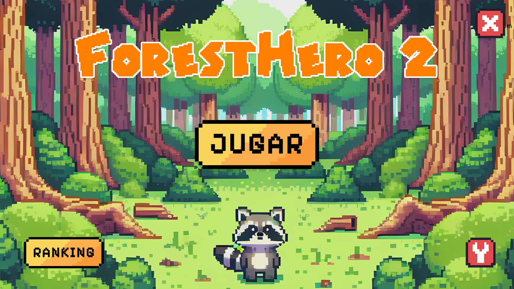
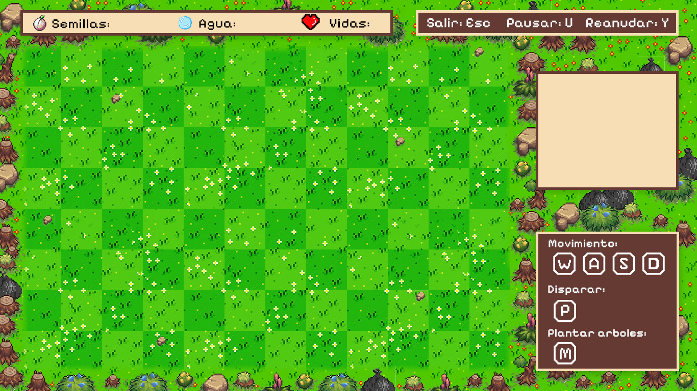
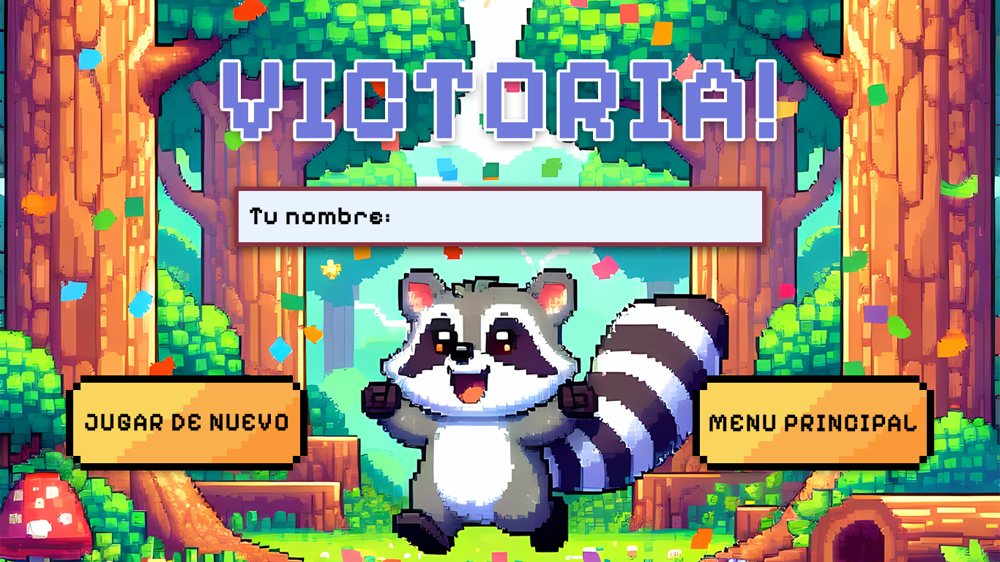



# ForestHero2 🌲🎮

<!-- Reemplaza owner/repo cuando publiques en GitHub -->

<!--  -->
<!--  -->

Un juego 2D de reforestación hecho en C++/CLI + Windows Forms. Protege el bosque, planta árboles y vence a los enemigos mientras gestionas recursos y tiempo.

## Capturas

    

    

    

## Tabla de contenidos

- Descripción rápida
- Características
- Controles
- ⚠️ Disclaimer / Integridad académica
- Prerrequisitos
- Instalación y ejecución
- Compilar desde código
- Solución de problemas
- Roadmap
- Contribuir
- Créditos y licencias
- Autores

## Descripción rápida

ForestHero2 es un juego 2D desarrollado en C++ con C++/CLI y Windows Forms. Controlas a un guardián del bosque que debe recolectar semillas y agua, plantar árboles y enfrentarse a enemigos para reforestar antes de que el tiempo se agote.

Proyecto académico (UPC). Este juego fue el proyecto final del curso de Algoritmos 2024‑2 — UPC.

## Características

- Jugabilidad arcade con presión de tiempo y puntuación.
- Recolección y gestión de recursos (semillas y agua).
- Plantación de árboles y porcentaje de reforestación como objetivo.
- Enemigos, power‑ups y un posible aliado.
- Interfaz completa: menú, instrucciones, créditos, victoria y derrota.
- Músicas y efectos en distintos estados del juego.

## Controles

- Movimiento: W A S D
- Plantar árbol: M (requiere semillas y agua)
- Disparar semilla: P
- Pausa/Continuar: U / Y
- Salir: Esc

## ⚠️ Disclaimer / Integridad académica

Este repositorio es público con fines educativos y de referencia.

- Se prohíbe el plagio total o parcial y cualquier uso que vulnere el Código de Integridad/Probidad Académica de la UPC o de cualquier otra institución educativa.
- Puedes estudiar el código y reutilizar ideas o fragmentos no evaluados citando la fuente. Todo trabajo evaluable debe ser de autoría propia.
- Los autores no asumen responsabilidad por usos indebidos. Cualquier fork o contribución debe respetar estas condiciones.

Consulta `ACADEMIC_INTEGRITY.md` para más detalles.

## Prerrequisitos

- Windows 10/11
- Visual Studio 2022 (v17) con el workload “Desktop development with C++” y soporte C++/CLI
- .NET Framework 4.7.2 targeting pack
- Windows 10 SDK (10.0.x)

## Instalación y ejecución (binarios)

- Descarga el ZIP desde la pestaña Releases de GitHub y ejecuta el `.exe` dentro de la carpeta correspondiente (Debug/Release/x86/x64). Si no hay releases aún, compila desde código.

## Compilar desde código

1) Clona o descarga el repositorio.
2) Abre `ForestHero2.sln` en Visual Studio.
3) Selecciona la configuración (Debug/Release) y plataforma (x86/x64).
4) Compila con Ctrl+Shift+B.
5) Ejecuta con F5 o Ctrl+F5.

Notas:
- El proyecto usa C++/CLI y Windows Forms (.NET Framework 4.7.2).
- Los recursos se cargan desde `ForestHero2/Resources/...`.

## Solución de problemas

- MSBuild/Toolset v143 no encontrado: instala el componente “MSVC v143” desde el Visual Studio Installer.
- Falta .NET 4.7.2 targeting pack: instálalo desde Instalador de VS > Componentes individuales.
- No se reproducen sonidos (.wav): verifica que los archivos de `Resources/Sounds/` existan y que el volumen del sistema no esté silenciado.
- Recursos no encontrados: asegúrate de ejecutar desde la carpeta donde el ejecutable puede resolver rutas relativas a `Resources/`.
- Mapeo Debug|x64 inusual en la solución: en `ForestHero2.sln`, corrige si ves que Debug|x64 apunta a Release|x64.

## Roadmap

- Pulido de UI y feedback in‑game.
- Más niveles y tipos de enemigos.
- Sistema de guardado fuera del repositorio (AppData).
- Publicación de builds en Releases con CI.

## Contribuir

Las contribuciones son bienvenidas. Antes de abrir un PR:
- Crea un issue con el cambio propuesto.
- Sigue el estilo del proyecto y evita introducir binarios en Git.
- Verifica que compila en Debug y Release.

## Créditos y licencias

- Código: MIT (ver `LICENSE.md`).
- Assets (imágenes, fuentes, sonidos): CC BY‑NC 4.0 por defecto (ver `LICENSE-assets`) con excepciones detalladas en `CREDITS.md` y `THIRD-PARTY-NOTICES.md`.
- Documentación/capturas del README: CC BY‑NC‑SA 4.0 (ver `LICENSE-docs`).

## Autores

- Oscar Lizandro Vasquez Llave
- Mauricio Teran Zavala
- Jahat Jassiel Trinidad Leon

---

Licencia: MIT • © 2025 Autores del proyecto.
